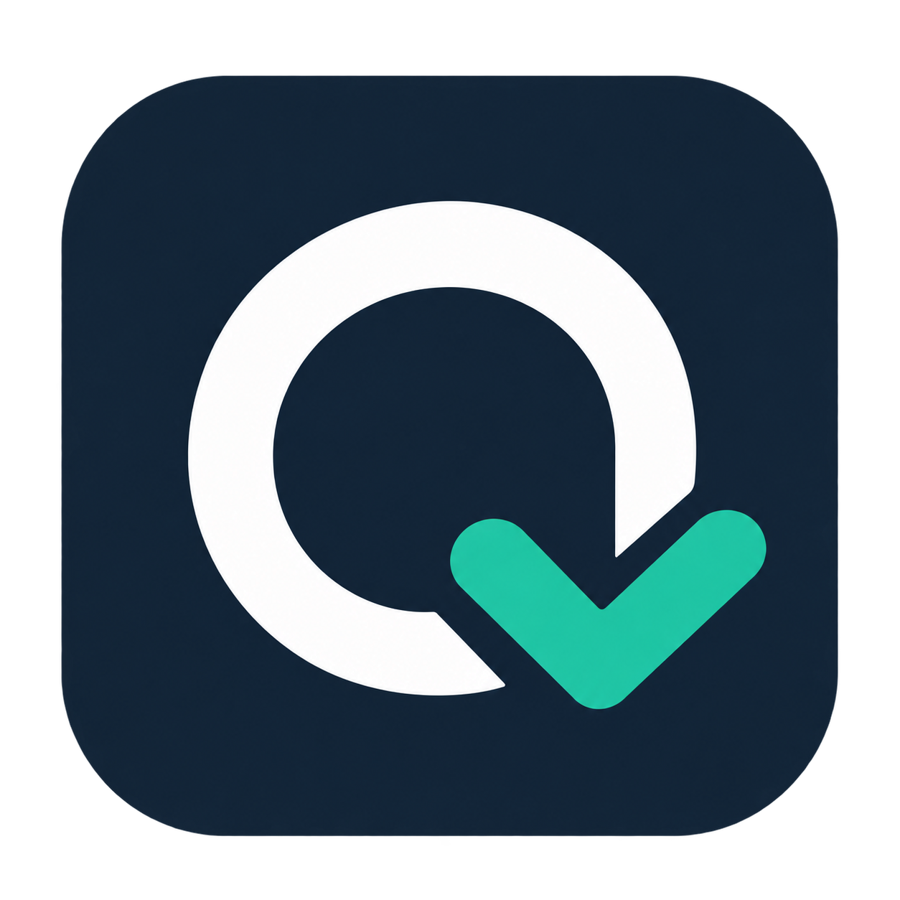
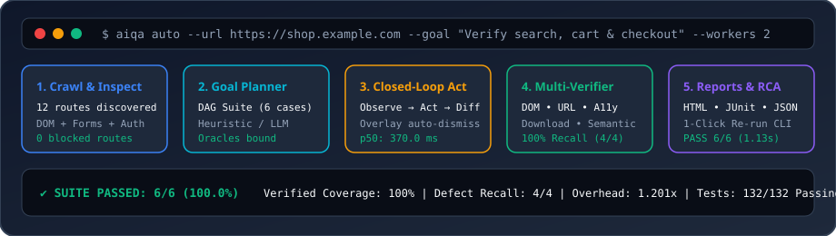

<div align="center">
  

# AIQA — Autonomous AI Website Testing

<p><strong>Closed-loop autonomous QA agent that crawls multi-page web apps, generates goal-driven test suites, verifies DOM/A11y/business-rule oracles, and diagnoses root causes—with or without an LLM API key.</strong></p>

[](./.github/workflows/ci.yml)
[](./PROGRESS.md)
[](./tests)
[](./LICENSE)
[](./USER_GUIDE.md)

[**Quickstart**](#-quickstart) · [**Why AIQA?**](#-why-aiqa) · [**Architecture**](#-architecture) · [**Benchmarks**](#-performance-benchmarks) · [**User Guide**](./USER_GUIDE.md) · [**Operating Model**](./OPERATING_MODEL.md)

<picture>
  <source media="(prefers-color-scheme: dark)" srcset="./assets/aiqa-hero-dark.svg" />
  <source media="(prefers-color-scheme: light)" srcset="./assets/aiqa-hero-light.svg" />
  
</picture>

</div>

---

## Why AIQA?

Traditional end-to-end web testing forces engineering teams to choose between **fragile hand-written selectors** that break on every UI tweak and **opaque vision-only LLM agents** that hallucinate passing results, leak secrets, and cost dollars per test run.

**AIQA** bridges both worlds with an enterprise-grade, **execution-verified closed-loop architecture**:
- **Zero False-Pass Guarantees**: Every browser action computes a deterministic `state_delta` (URL, DOM interactive count, modal state, and console/network errors). Missing business-rule oracles are strictly flagged `INCONCLUSIVE` rather than silently passing.
- **Dual-Engine Autonomy (Free Heuristic + Optional LLM)**: Run 100% offline and free using the built-in heuristic goal decomposer and DOM inspector, or plug in OpenAI, DeepSeek, or local Ollama models for semantic vision verification.
- **Enterprise CI & Governance Ready**: Built-in pre-browser origin policy checks, automatic secret redaction (`${ENV_VAR}`), multi-role RBAC `storage_state` validation, HTTP setup/teardown fixtures with LIFO cleanup, and tamper-evident JSONL audit logs.

---

## Key Features

- **Closed-Loop Autonomous Exploration (`aiqa auto`)**: Crawls multi-page routes, detects blocked routes (`401`/`403`/`5xx`), decomposes natural-language goals into DAG-ordered test cases, executes them, and automatically synthesizes follow-up tests for uncovered feature gaps.
- **Observable Action Driver (`JevRunner` + `ActionDriver`)**: Re-observes page state after every step, automatically dismisses blocking cookie/newsletter modals, supports `iframe`, open Shadow DOM, popups, file uploads, and enforces per-run step/duration/cost budgets.
- **Multi-Oracle Verification Suite**: Combines fast deterministic verifiers (`DomVerifier`, `UrlVerifier`, `AccessibilityVerifier` for WCAG/ARIA, `DownloadVerifier`) with optional `SemanticVerifier` vision checks and `business_rule` postcondition assertions.
- **Execution-Verified Coverage Analysis (`aiqa coverage`)**: Distinguishes merely *planned* features from *execution-verified* features (`verified_features` vs. `failed_feature_ids` and `inconclusive_feature_ids`).
- **One-Click Interactive HTML Dashboard & JUnit Reports**: Standalone dark/light HTML reports with `state_delta` inspection, one-click **Copy Re-run CLI (`--select`)**, **Copy Bug Report Markdown**, and CI-native JUnit XML (`--junit`).
- **Smart Developer Experience (`aiqa doctor` & `aiqa init`)**: Environment readiness diagnostics, zero-config `.env` loading, bare-domain URL normalization, and instant starter suite scaffolding.

| Pillar | Core Capabilities | Enterprise & CI Controls |
| :--- | :--- | :--- |
| **Explore & Plan** | Multi-page `SiteCrawler`, DOM `SiteInspector`, natural-language `decompose_goal` | Role-aware planning (`--role`), explicit omission & capability degradation notes |
| **Execute & Observe** | Topological DAG runner, bounded parallel `--workers`, transient `--retries`, `--shard` | Pre-browser origin/suite policy (`aiqa/security/policy.py`), HTTP LIFO fixtures |
| **Verify & Govern** | DOM, URL, WCAG A11y, file downloads, LLM vision, `business_rule` oracle guard | Secret redaction, tamper-evident `AuditLogger`, artifact pruning (`aiqa retention`) |

---

## Architecture

```mermaid
flowchart LR
    Goal["Goal + URL + Role\n(aiqa auto / plan)"] --> Crawler["SiteCrawler & Inspector\nRoutes, Forms & Blocked HTTP"]
    Crawler --> Planner["Dual-Engine QA Planner\nHeuristic + LLM Goal Decomposition"]
    Planner --> Runner["DAG TestRunner\nWorkers, Shards, Retries & Fixtures"]
    Runner --> Driver["Closed-Loop ActionDriver\nObserve -> Act -> Dismiss Modals -> Diff"]
    Driver --> Verifier["Multi-Oracle Verifier\nDOM / URL / A11y / Download / Vision"]
    Verifier --> Coverage["Coverage & Gap Follow-Up\nVerified vs Failed / Inconclusive"]
    Coverage --> Reports["FailureAnalyzer & Reports\nHTML Dashboard / JUnit XML / JSON / Audit"]
```



<details>
<summary><b>🔎 View ASCII Pipeline & Execution Dataflow</b></summary>

```text
"Test login, search, and checkout flows" (--url + --goal + --role)
         ↓
   SiteCrawler & Inspector  ← crawls multi-page routes, forms & blocked routes (401/403/5xx)
         ↓
   QA Planner (LLM / Rule)  ← decomposes goal into flows, roles & business-rule oracles
         ↓
   DAG Test Runner          ← multi-parent topological scheduling, workers, retries & timeouts
         ↓
   ActionDriver (Closed-Loop) ← observe → act → dismiss overlays → re-observe (state_delta)
         ↓
   Multi-Verifier           ← DOM / URL / A11y / Download / Semantic / Business-Rule Oracles
         ↓
   PASS / FAIL / INCONCLUSIVE + Execution-Verified Coverage & Automatic Gap Follow-Up
         ↓
   Failure Analyzer         ← root-cause diagnosis + HTML / JUnit / JSON reports
```

</details>

---

## Quickstart

> 💡 **New to AIQA or web testing?** Read our step-by-step **[Beginner's Operating Guide (USER_GUIDE.md)](./USER_GUIDE.md)** to get started in under 3 minutes with zero coding required.

### 1. Install AIQA & Chromium

```bash
pip install -e . && playwright install chromium
```

### 2. Verify Environment & Run Closed-Loop Autonomous QA

```bash
# 0. Check environment readiness or scaffold a starter test suite & .env in seconds
python3 -m aiqa.cli doctor
python3 -m aiqa.cli init --url example.com --output ./sample_tests/starter_suite.json

# 1. One-click closed-loop autonomous test (crawls routes, plans by goal, runs & fills gaps)
python3 -m aiqa.cli auto --url https://books.toscrape.com --goal "Test catalog search and navigation" --max-pages 5 --max-tests 5

# 2. Or generate & execute a deterministic test suite with HTML + JUnit reports
python3 -m aiqa.cli plan --url https://example.com --goal "Verify core navigation and forms" --output ./sample_tests/my_tests.json
python3 -m aiqa.cli test --tests ./sample_tests/my_tests.json --html ./reports/dashboard.html --junit ./reports/junit.xml

# 3. Check execution-verified feature coverage or attach to an active Chrome session via CDP
python3 -m aiqa.cli coverage --tests ./sample_tests/my_tests.json --report ./reports/run_latest.json
python3 -m aiqa.cli test --url https://www.amazon.com --tests ./sample_tests/amazon_chair.json --cdp http://127.0.0.1:9222
```

**Expected output**:

```console
[INFO] AIQA Doctor: Python 3.11+ OK | Playwright Chromium OK | Security Policy OK
[INFO] Crawling https://books.toscrape.com (max_pages=5) ... discovered 5 routes, 12 features
[INFO] Planned 5 goal-driven test cases (mode=heuristic, goal="Test catalog search and navigation")
[PASS] TC-001: Verify homepage catalog header and primary navigation (364.2 ms)
[PASS] TC-002: Verify category sidebar route transition and breadcrumb state_delta (378.9 ms)
[INFO] Execution-Verified Coverage: 100.0% of targeted flows verified | HTML Report: ./reports/dashboard.html
```

*(Terminal demo sessions in `./assets/` can also be recorded and replayed deterministically using `vhs` or `asciinema`.)*

---

## Performance Benchmarks

### 1. Reproducible End-to-End AIQA Pipeline Benchmark (`aiqa benchmark`)

The end-to-end benchmark harness (`aiqa/benchmarks/harness.py`, `scripts/run_aiqa_benchmark.py`) executes the full AIQA pipeline (`TestRunner` → `BrowserSession` → `JevRunner` → `ActionDriver` → `DomVerifier`/`UrlVerifier` → `JsonReporter`/`JUnitReporter`/`HtmlReporter`) against a deterministic local fixture web application using the frozen suite `benchmarks/frozen_suite_v1.json`.

| Metric (`frozen_suite_v1`, `workers=2`, `warmup=1`) | AIQA End-to-End Pipeline | Direct Playwright Baseline |
| :--- | :--- | :--- |
| Pass rate | **100.0% (6 / 6 passed)** | **100.0% (6 / 6 passed)** |
| Wall-clock time | **1.1286 s** | **0.9396 s** |
| Latency (p50 / p95) | **370.0 ms / 387.5 ms** | — |
| Overhead ratio (postcondition diffing + reports + screenshots) | **1.201x** | 1.000x |
| Seeded defect recall (`BuggyFixtureSiteServer`, `--evaluate-defects`) | **4 / 4 (100.0% recall)** | — |
| Autonomous planner defect recall (`planner_defect_recall`) | **4 / 4 (100.0% recall, 0 false alarms)** | — |

Reproduce from a clean checkout (including seeded defect-detection evaluation):

```bash
python3 scripts/run_aiqa_benchmark.py --workers 2 --warmup 1 --compare-baseline --evaluate-defects
```

- **Seeded defects caught / recall**: **4 / 4 (`100.0%` recall)** across broken search console error, dead cart button, HTTP 500 checkout gateway error, and HTTP 500 admin route.
- **Autonomous planner defects caught (`planner_defect_recall`)**: **4 / 4 (`100.0%` recall, `0` false alarms)** via end-to-end `SiteCrawler` → `TestPlanner.generate_suite` → `TestRunner`.
- **Healthy controls / false-alarm rate**: **2 / 2 passed (`0.0%` false-alarm rate, `100.0%` precision)**; **root-cause diagnosis accuracy**: **`100.0%`**; **missing-oracle business rule control**: **1 / 1 flagged `inconclusive=True`**.

<details>
<summary><b>📊 2. Historical 1,000-Case Direct Playwright DOM Benchmark</b></summary>

The checked-in 1,000-case result is a **direct Playwright DOM benchmark**, not an end-to-end run through AIQA. The harness opens live public pages and performs navigation and DOM assertions with 10 concurrent Playwright workers. It bypasses AIQA's planner, action driver, verifier, orchestrator, and reporters.

| Stored run metric | Measured value |
| :--- | :--- |
| Cases | 1,000 |
| Passed / failed | 692 / 308 |
| Pass rate | **69.2%** |
| Wall-clock time | 16.8 seconds |
| Mean case latency | 160.39 ms |
| P95 case latency | 270.03 ms |

Earlier vision latency, token, and cost figures were estimates based on assumed per-step values; they were not measurements from equivalent workloads and are not presented as benchmark results. See [BENCHMARK_REPORT.md](./BENCHMARK_REPORT.md) for full methodology and reproduction details.

</details>

---

## Dual-Engine AI Models & Configuration

AIQA supports a built-in heuristic path and an optional LLM path. The heuristic path needs no model API key; when used with complex natural-language goals, it decomposes target flows (`auth`, `search`, `cart`, `checkout`, `admin`, `pricing`, `form`) and records explicit capability degradation notes or `inconclusive` flags when business-rule oracles are missing.

| Provider | Supported Models | Configuration | Cost / Privacy |
| :--- | :--- | :--- | :--- |
| **Built-in Heuristic** *(Default Fallback)* | Rule-based DOM + Goal Decomposer | Zero config required (`--no-llm` or no API key set) | **100% Free & Offline** |
| **OpenAI** | `gpt-4o-mini`, `gpt-4o` | `OPENAI_API_KEY=sk-...` | Best balance of speed & vision accuracy |
| **DeepSeek** | `deepseek-chat`, `deepseek-reasoner` | `OPENAI_BASE_URL=https://api.deepseek.com/v1`<br>`OPENAI_API_KEY=...`<br>`OPENAI_MODEL=deepseek-chat` | Extremely cost-effective |
| **Local Ollama** | `llama3`, `mistral`, `qwen2.5` | `OPENAI_BASE_URL=http://localhost:11434/v1`<br>`OPENAI_MODEL=llama3:latest` | 100% local, offline & private |
| **OpenAI-Compatible Gateways** | LiteLLM, OpenRouter, vLLM | `OPENAI_BASE_URL=...`<br>`OPENAI_API_KEY=...` | Flexible multi-model gateway |

```bash
# Configure via .env (automatically loaded by AIQA CLI) or override per command:
cp .env.example .env
python3 -m aiqa.cli plan --url https://example.com --model gpt-4o --output ./tests.json
```

---

## Architecture & Enterprise Readiness Status

Detailed milestone records are documented in **[PROGRESS.md](./PROGRESS.md)**, **[ENTERPRISE_PLAN.md](./ENTERPRISE_PLAN.md)**, and **[OPERATING_MODEL.md](./OPERATING_MODEL.md)**.

<details open>
<summary><b>🏆 Stage 1–5 & Enterprise Phase 0–5 Milestone Matrix (132/132 Tests Passing)</b></summary>

| Stage / Phase | Milestone | Status | Key Breakthroughs & Deliverables |
| :--- | :--- | :---: | :--- |
| **Stage 1–5** | **Core Runner, Planner, Crawler, ActionDriver & Dashboard** | **COMPLETED ✅** | Standardized Pydantic v2 schemas, Browser lifecycle, Triple Verifier, SiteCrawler, FailureAnalyzer, HTML Dashboard. |
| **Phase 0** | **Execution Truth & Test Contracts** | **COMPLETED ✅** | Typed `BrowserAction` contracts, fail-closed action execution, observable postcondition state diffing, `business_rule` oracle & `inconclusive` guard, planning omission/degradation notes. |
| **Phase 1** | **Safe & Reproducible CI Use** | **COMPLETED ✅** | Pre-browser suite/origin policy validation (`aiqa/security/policy.py`), automatic secret redaction (`aiqa/security/redaction.py`), JUnit XML (`--junit`), isolated CDP/storage-state modes, GitHub Actions CI (`.github/workflows/ci.yml`). |
| **Phase 2** | **Credible Evaluation & Scalable Execution** | **COMPLETED ✅** | End-to-end benchmark harness (`aiqa benchmark`) + seeded & planner defect evaluation (`--evaluate-defects`, `defect_recall=1.0`, `planner_defect_recall=1.0`), multi-parent DAG topological grouping, per-test timeouts, deterministic filtering & sharding (`--select`, `--tag`, `--shard`), bounded parallel workers (`--workers`), transient-only retry (`--retries`), multi-shard report aggregation (`aiqa report`). |
| **Phase 3** | **Application Integration & Operating Model** | **COMPLETED ✅** | Multi-role RBAC `storage_state` + expiry validation (`aiqa/auth/`), `${ENV_VAR}` CI secret injection, API setup/teardown fixtures with `{ENTITY_ID}` binding & guaranteed LIFO cleanup (`aiqa/fixtures/`), iframes, open Shadow DOM, popups, uploads, downloads, mobile viewports, WCAG/ARIA checks (`AccessibilityVerifier`), audit logging (`AuditLogger`), and artifact retention (`aiqa retention`). |
| **Phase 4** | **Closed-Loop Exploration, Goal Planning & Execution-Backed Coverage** | **COMPLETED ✅** | Multi-page `SiteCrawler` with `blocked_routes`, goal decomposition (`decompose_goal`, `--role`), `ActionDriver` post-step re-observation (`state_delta`), modal dismissal & step/duration/cost budgets, execution-verified `CoverageAnalyzer` (`verified_features` vs `failed_feature_ids`/`inconclusive_feature_ids`), and closed-loop `aiqa auto` gap follow-up. |
| **Phase 5** | **Developer Experience (`doctor`, `init`, Smart CLI) & HTML Dashboard UX** | **COMPLETED ✅** | `aiqa doctor`, `aiqa init`, automatic `.env` loading, bare-domain URL normalization, optional `--url` on `test`/`coverage`, auto-latest `aiqa report`, and HTML Dashboard one-click `Copy Re-run CLI` (`--select`), `Copy Bug Report` Markdown, `Expand/Collapse All`, `Inconclusive` filter, and `state_delta` view (**132/132 tests passing**). |

</details>

<details>
<summary><b>📁 Full Project Structure</b></summary>

```text
aiqa/
├── aiqa/
│   ├── cli.py                  # CLI entry point (auto, init, doctor, plan, test, coverage, report, benchmark, retention)
│   ├── models/
│   │   ├── test_case.py        # Pydantic v2 schemas (TestCase, TestResult, FixtureSpec, AttemptRecord)
│   │   └── coverage.py         # FeatureRegistry & CoverageReport models
│   ├── auth/
│   │   └── workflow.py         # Role storage_state validation, expiry checks & CI ${ENV_VAR} injection
│   ├── fixtures/
│   │   └── lifecycle.py        # Setup/teardown HTTP fixtures, {ENTITY_ID} binding & guaranteed LIFO cleanup
│   ├── security/
│   │   ├── policy.py           # Pre-browser suite & origin policy enforcement
│   │   ├── redaction.py        # Automatic secret & sensitive selector redaction
│   │   ├── audit.py            # Tamper-evident JSONL audit logging
│   │   └── retention.py        # Artifact retention pruning manager
│   ├── benchmarks/
│   │   └── harness.py          # Reproducible end-to-end AIQA pipeline benchmark harness
│   ├── executor/
│   │   ├── browser_session.py  # Playwright browser manager, mobile/viewport & download listeners
│   │   ├── action_driver.py    # Action Driver (click, fill, press, navigate, wait, upload, popup, iframes)
│   │   └── jev_runner.py       # Execution coordinator & postcondition state diffing
│   ├── planner/
│   │   ├── site_inspector.py   # DOM interactive element extraction
│   │   └── test_generator.py   # LLM & heuristic test suite planner
│   ├── crawler/
│   │   └── site_crawler.py     # Multi-route exploration & feature classification
│   ├── verifier/
│   │   ├── dom.py              # DOM, iframe & open Shadow DOM assertions
│   │   ├── url.py              # URL & route regex assertions
│   │   ├── accessibility.py    # Deterministic WCAG/ARIA accessibility verifier
│   │   ├── download.py         # Deterministic file download verifier
│   │   └── semantic.py         # LLM vision qualitative assertions
│   ├── analyzer/
│   │   └── failure_analyzer.py # Root-cause diagnosis engine
│   ├── orchestrator/
│   │   ├── runner.py           # Test execution pipeline coordinator (sharding, workers, retries, fixtures)
│   │   └── coverage.py         # Feature coverage & gap analyzer
│   └── reports/
│       ├── json_report.py      # Structured JSON run reports
│       ├── junit_report.py     # CI-native JUnit XML reports
│       └── html_report.py      # Standalone interactive HTML dashboard
├── .agents/
│   ├── rules/
│   │   └── project-doc-sync.md # Workspace rule enforcing mandatory doc synchronization
│   └── skills/
│       ├── aiqa-progress-tracker/          # Step-by-step progress & documentation sync skill
│       ├── better-readme/                  # GitHub Trending README authoring & automated evaluation skill
│       ├── subagent-driven-development/    # Multi-agent task implementation & two-stage review skill
│       ├── dispatching-parallel-agents/    # Parallel subagent orchestration skill
│       ├── multi-agent-patterns/           # Multi-agent supervisor, swarm & consensus patterns skill
│       ├── requesting-code-review/         # Subagent code review dispatch skill
│       └── receiving-code-review/          # Code review evaluation & resolution skill
├── benchmarks/                 # Frozen benchmark suites (frozen_suite_v1.json)
├── assets/
│   ├── aiqa-icon.png           # AIQA project icon
│   ├── aiqa-hero-dark.svg      # Dark-mode pipeline hero banner
│   └── aiqa-hero-light.svg     # Light-mode pipeline hero banner
├── sample_tests/               # Example test suites (Amazon, HN, shopping, etc.)
├── tests/                      # Unit, contract, safety, scale, UX, and enterprise integration tests (132 tests)
├── AGENTS.md                   # Repository-wide agent rules & doc sync contract
├── ENTERPRISE_PLAN.md          # Phase 0–3 enterprise readiness plan & acceptance matrix
├── OPERATING_MODEL.md          # Enterprise governance, RBAC, retention & incident response guide
├── BENCHMARK_REPORT.md         # End-to-end & direct Playwright benchmark methodology
├── USER_GUIDE.md               # Operating manual & CLI reference
└── PROGRESS.md                 # Permanent stage & breakthrough log
```

</details>

---

## Contributing & Community

Contributions, bug reports, and feature requests are welcome!
- **Issues & Bug Reports**: Open an issue with a reproducible test suite JSON or HTML dashboard export.
- **Discussions & Architecture Proposals**: Review [ENTERPRISE_PLAN.md](./ENTERPRISE_PLAN.md) and [OPERATING_MODEL.md](./OPERATING_MODEL.md) before proposing new verifiers or security controls.
- **Pull Requests & Verification Gate**: Run `python3 .agents/skills/aiqa-progress-tracker/scripts/verify_and_check_docs.py` (executes `ruff check .`, `pytest -q`, and doc sync checks) before submitting a PR.

---

## License

Released under the **MIT License**.
